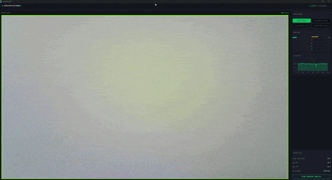

# FruitVisionRT

Real-time fruit detection and classification for desktop (GPU) and Raspberry Pi 4.



This refined codebase contains only the files that directly contributed to the final system.
Older versions and unused checkpoints have been excluded for clarity.

---

## Quick Start

### 1. Prerequisites

- Python 3.10 (required — TensorFlow 2.10 does not support Python 3.11+)
- A webcam connected to your machine
- Git

### 2. Clone the Repository

```bash
git clone git@github.com:DavidMembreno/FruitVisionRT.git
cd FruitVisionRT
```

### 3. Create and Activate a Virtual Environment

```bash
python3.10 -m venv venv

# Linux / WSL
source venv/bin/activate

# Windows
venv\Scripts\activate
```

### 4. Install Runtime Dependencies

```bash
pip install -r requirements.txt
```

This installs everything needed to run `main_final.py` on CPU. No GPU or CUDA required.

### 5. Run the Application

```bash
python main_final.py
```

---

## Entry Points

| File | Purpose |
|---|---|
| `main_final.py` | Desktop runtime (webcam, full GUI) |
| `main_final_pi.py` | Raspberry Pi 4 runtime (PiCamera2) |

---

## Models

| Model | Path | Framework |
|---|---|---|
| YOLOv8 Detector | `Models/detector/best.pt` | PyTorch / Ultralytics |
| MobileNetV2 Classifier | `Models/classifier/clv2_mobilenetv2_smooth05_v2.tflite` | TensorFlow Lite |

The base pretrained model (`yolov8n.pt`) from Ultralytics is included but not used in the final system.

---

## Runtime Dependencies (`requirements.txt`)

These are the only libraries needed to run the application:

| Library | Purpose |
|---|---|
| `tensorflow-cpu` | Runs the TFLite classifier model |
| `ultralytics` | Loads and runs the YOLOv8 detector |
| `torch` / `torchvision` | Required by Ultralytics under the hood |
| `opencv-python` | Webcam capture and frame processing |
| `numpy` | Array operations for inference |
| `Pillow` | Converts OpenCV frames for Tkinter display |
| `tkinter` | GUI framework (built into Python) |

---

## Training Dependencies (`requirements_training.txt`)

Only needed if you want to retrain the models. Install on top of the runtime requirements:

```bash
pip install -r requirements_training.txt
```

| Library | Purpose |
|---|---|
| `jupyterlab` | Runs training notebooks |
| `scikit-learn` | Evaluation metrics (confusion matrix, classification report) |
| `seaborn` / `matplotlib` | Training performance visualizations |
| `pandas` | Data handling during training |
| `tensorboard` | Training loss and accuracy monitoring |
| `onnx` / `onnxruntime` | ONNX model export and inference testing |
| `tf2onnx` / `onnx2tf` | TF → ONNX → TFLite conversion pipeline |
| `tensorflow-addons` | Additional TF training utilities |

> **Note on GPU Training:** The models were originally trained using a nightly build of PyTorch with CUDA 12.8 support for NVIDIA Blackwell (RTX 5070) architecture. Standard PyTorch releases did not support Blackwell at the time. If retraining on a Blackwell GPU, install the appropriate nightly build manually before installing `requirements_training.txt`.

---

## Training

| File | Purpose |
|---|---|
| `Training/train_detector.py` | YOLOv8 detector training script |
| `Training/train_classifier_clv2.ipynb` | MobileNetV2 classifier training notebook |
| `Training/Detector Performance Data/` | YOLOv8 training metrics and plots |
| `Training/Classifier Performance Data/` | MobileNetV2 metrics, confusion matrix, F1 plots |

---

## Utilities (`Utils/`)

Data preparation and QA scripts used during dataset construction. Not needed to run the application.

| Script | Purpose |
|---|---|
| `convert_voc_to_yolo.py` | Converts Pascal VOC XML annotations to YOLO format |
| `fix_invalid_annotations.py` | Removes malformed bounding boxes |
| `convert_paths.py` | Normalizes dataset split paths |
| `generate_clv2_from_yolo.py` | Builds classification crops from YOLO bounding boxes |
| `clean_class_dirs.py` / `clean_val_test_dirs.py` | Ensures unified class set across splits |
| `balance_train_classes.py` | Balances class distribution in training set |
| `check_labels.py` / `check_yolo_labels.py` / `check_classifier_classes.py` | QA checks |
| `classification_data_prep.ipynb` / `detection_data_prep.ipynb` | Dataset preparation notebooks |
| `GPU_check.py` | Verifies CUDA and PyTorch environment |
| `camera_test.py` | Tests OpenCV webcam access |
| `convert_yolo_to_tflite.py` | Experimental ONNX/TFLite export (not used in final system) |

---

## Test Scripts (`TestScripts/`)

Early prototypes, not needed for the final system.

| Script | Purpose |
|---|---|
| `class_main.py` | Classifier-only demo |
| `yolo_main.py` | YOLO detector-only demo |
| `main.py` | Early prototype |

---

## Docker

Run FruitVisionRT without any manual Python or dependency setup using Docker.

### Prerequisites
- [Docker Desktop](https://www.docker.com/products/docker-desktop/) installed
- A webcam connected to your machine (Linux only for live feed)

### Run with Docker (Linux)
```bash
xhost +local:docker
docker compose up
```

That's it. Docker will pull the image from Docker Hub automatically and launch the app with your webcam and full GUI.

### Platform Notes

| Platform | GUI | Live Webcam Feed |
|---|---|---|
| Linux (native) | Yes | Yes |
| Windows WSL2 | Yes | No — WSL2 does not expose webcam as `/dev/video0` |
| macOS | Requires [XQuartz](https://www.xquartz.org/) | Limited |
| Windows (native) | Not recommended | No |

> The demo GIF above shows the full live detection experience on Linux.

### Docker Hub

The prebuilt image is available at:
[`docker.io/davidmembreno/fruitvisionrt`](https://hub.docker.com/r/davidmembreno/fruitvisionrt)

---

## Data Source

Models were trained on the [LVIS Fruits and Vegetables dataset](https://www.kaggle.com/datasets/henningheyen/lvis-fruits-and-vegetables-dataset) from Kaggle.

Both YOLOv8 (detector) and MobileNetV2 (classifier) were trained on this dataset.
The classifier dataset was cropped directly from YOLO detection labels.

---

## License

Released under the MIT License. See `LICENSE.txt`.

---

## Contact

**Student:** David Membreno  
**Mentor:** Dr. Chang-Shyh Peng  
California Lutheran University
